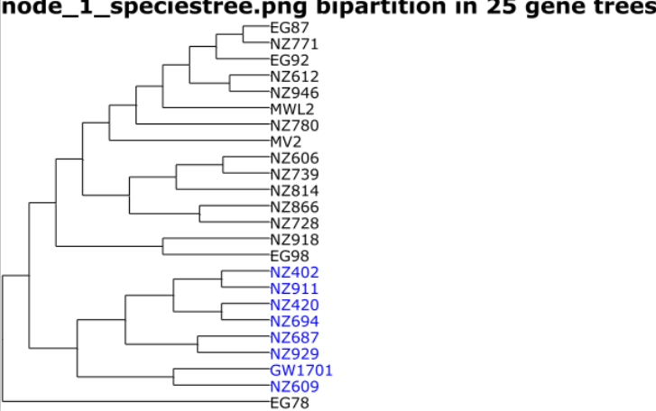
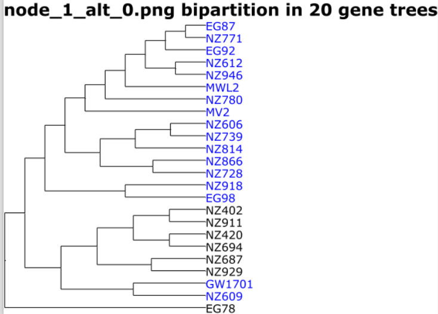

# Minority Report

This script will summarize the concordant and conflicting bipartitions found in a Phyparts analysis by plotting them on the species tree. 

One specific node must be specified. You can get the numerical identifier for the target node by running `phypartspiecharts.py` with the `--show_nodes` flag.

## Dependencies

[ETE3](etetoolkit.org) with Python > 2.7

[Linux convert](https://www.imagemagick.org/script/convert.php) (part of ImageMagick)

## Usage

Run this from the same directory as the Phyparts ouptut.

```
python minority_report.py species.tre phyparts_root 31 3
```

This command will display the concordant and discordant bipartitions on `species.tre` using the `phyparts_root.alts`  and `phyparts_root.hist` files for node number 31. Only bipartitions occurring in at least 3 gene trees will be displayed.

## Output

A PDF will be generated in the current directory using the Linux tool `convert`. The first page of the PDF is the species phylogeny with the selected bipartition highlighted in blue text. In this example, a clade is highlighted on the species tree. The number of concordant gene trees (25, in this example) is indicated at the top:



All subsequent pages show the *same species tree topology* but alternative, conflicting bipartitions are highlighted. For example, this image shows an alternative bipartition for the same node as above:




Species GW1701 and NZ609 are found in a bipartition with the top clade in 20 gene trees (almost as many as the concordant bipartition!).


