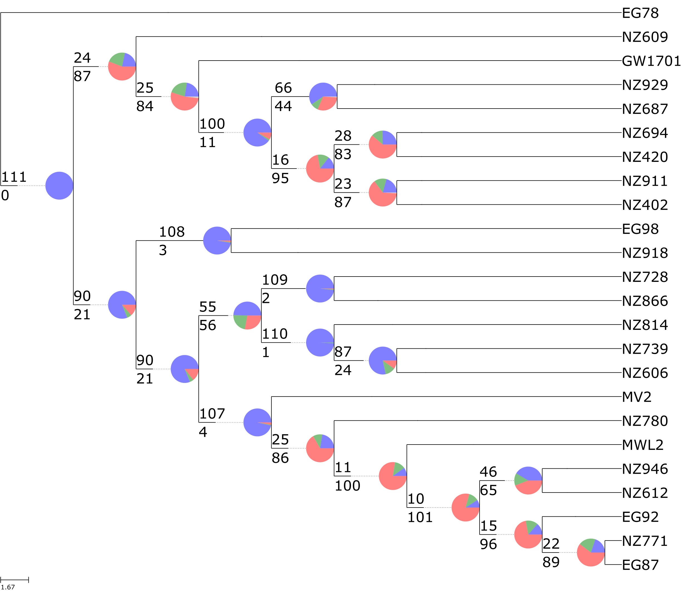

# PhypartsPieCharts

Using the output of PhyParts (https://bitbucket.org/blackrim/phyparts), plot pie charts on the species phylogeny showing the percentage of concordant gene trees, percentage in the top alternative bipartition, other conflicting topologies, and uninformative genes.

For more information about PhyParts, consult the [original paper by Smith et al.](https://bmcevolbiol.biomedcentral.com/articles/10.1186/s12862-015-0423-0) and the Python notebook [here](PhyParts_PieCharts.ipynb).

**Dependencies**

Requires [ETE3](http://etetoolkit.org/) and Python > 2.7


**Sample Usage**

```
python phypartspiecharts.py species.tre phyparts_root 158
```
Run the script from the directory containing the Phyparts output files. 

`species.tre` is the rooted species phylogeny used in Phyparts.

`phyparts_root` is the basename of the phyparts output. The default is `out`. The important output files are `out.concon.tre`, `out.hist`, `out.alt`, and `out.key`.

Finally, indicate the number of gene trees used in Phyparts. This is used to properly calculate the pie chart percentages.

The default output will be `pies.svg` containing a ladderized version of your species tree and pie charts on each node. The default color scheme is the percentage of gene trees that are:

* Blue: concordant
* Green: the top alternative biparttion
* Red: all other alternative bipartitions
* Black: uninformative for that node

Numbers above and below the branch also indicate the number of concordant and conflicting gene trees, respectively.

**Example Output**



**Other options**

* `--svg_name` Change the name of the svg image file. Default: `pies.svg`
* `--show_nodes` Display a tree with nodes labeled by the Phyparts numbering scheme. Useful for further inspection of alternative bipartitions (i.e. `minority_report.py`). The tree is opened in a new window, so this may not work for remote logins (use `ssh -Y`). 
* `--taxon_subst` Provide a comma delimited file that replaces tip labels in `species.tre` with a new label. Useful for converting accession numbers to species names, for example.
* `--colors` Provide custom colors for the pie chart wedges. RGB triplets (comma-separated), hexadecimal, and named colors can be used and should be separated by a space. The colors will correspond to the same order as above.
* `--to_csv` Generates CSV files for the categories and nodes, for input into ggTree in R (code provided by Ben Cooper).


